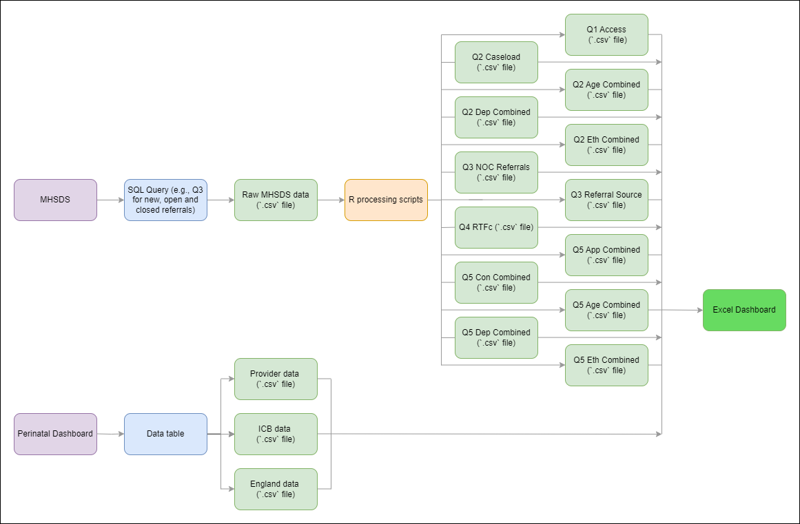

<br/>

<br/>

<br/>

# Perinatal Mental Health Dashboard

The repository contains all code used by the NHS Transformation Unit analytics team during the development of the Perinatal Mental Health Dashboard for South London Perinatal Provider Collaborative.

The purpose of this dashboard is to collect and visualise a number of key metrics related to Perinatal Mental Health services. Specifically, the dashboard visualises data specific to three Mental Health Trusts working within the NHS South West London Integrated Care Board. 

The data to inform the agreed metrics is exported from the Mental Health Services Data Set (MHSDS) and processed using R before being visualised within Microsoft Excel. The ambition of this project is to automate as much of this reporting process as possible, to reduce the analytical capacity needed to maintain the dashboard. You can find out more about the MHSDS [here](https://digital.nhs.uk/data-and-information/data-collections-and-data-sets/data-sets/mental-health-services-data-set).

<br/>

## The MHSDS extraction pipeline

The data for this dashboard is processed following the pipeline outlined below:

<br/>



<br/>

A series of SQL scripts have been developed to extract data for each constituent dashboard metric from MHSDS. The raw data is exported using these queries as a `.csv` file, before being imported to RStudio for processing. Within RStudio, a number of preprocessing scripts are utilised to process the raw data back into `.csv` files for importing into the Excel dashboard.

<br/>

Similarly, some data objects needed for the Excel dashboard are collected from the NHS England Perinatal Mental Health Dashboard available on the FutureNHS site. Guidance related to these datasets is included in the `tableau_extracts_guidance` document found within the `documentation > project_documentation` folder.

## Using the Repository

This codebase contains:

1. The SQL queries for extracting all relevant data from MHSDS.
2. The R scripts needed for processing the MHSDS data extracted using the SQL queries.

To recreate the data pipeline created for this dashboard, users will need to ensure their working directory is structured as outlined in the [Repository Structure](##-Repository-Structure) section of this ReadMe. This can be completed using Git or by simply downloading a zipped version of the tool from this repository.

Following the cloning of this repository to the user's preferred IDE, and assuming all the constituent files are located in the appropriate folders, all extracted MHSDS data can be processed by **running the `MHSDS_Processing_Pipeline.R` script** found within the `src > data_processing > r_scripts` folder. The processed data files, which are exported to the `data > processed_extracts` folder, can then be read into the MHSDS dashboard build. Please see the guidance located under `documentation > project_documentation` for a more in depth process outline.

It is worth noting that whilst the SQL scripts for querying MHSDS can be run within IDE's such as RStudio, in this project the MHSDS SQL scripts were ran within NCDR using a remote desktop connection and are as such outside of the R data pipeline.

<br/>

## Repository Structure

The current structure of the repository is detailed below:

``` plaintext

├─── data
     ├─── processed_extracts
     ├─── raw_extracts
     └─── supporting_data
├─── documentation
     └─── project_documentation
├─── images
└─── src
     ├─── config
          └─── sql_scripts
     ├─── data_processing
          └─── r_scripts
     └─── extract_queries
          └─── sql_scripts

```

<br/>

### `data`
This folder contain subfolders relating to raw **MHSDS extracts**, **processed MHSDS datasets** ready for importing to the Excel dashboard and **supporting data** such as a `Date_Code_Lookup` necessary for creating the processed extracts. 

### `documentation`
This folder contain the project documentation, including brief summaries of each scripts purpose and the dashboard metrics they relate to.

### `images`
This folder contains all images used in the outputs or repository such as the TU logo.

### `src`
All code is stored within the `src` folder. This is then divided into `extract_queries` for the SQL scripts that query NCDR and `data_processing` for R scripts employed in processing raw data. A single R script is stored in the `config` subfolder which provides a list of packages needed to process any MHSDS data within R.


<br/>

## Contributors

This repository has been created and developed by:
-   [Andy Wilson](https://github.com/ASW-Analyst)
-   [Elliot Royle](https://github.com/elliotroyle)
-   [Simon Wickham](https://github.com/SiWickham)
